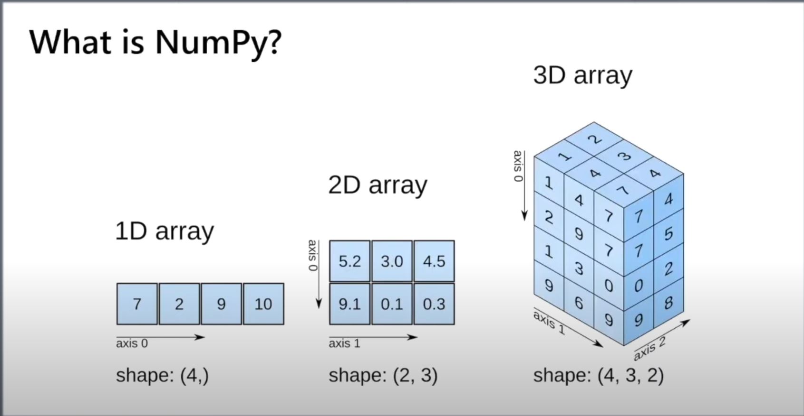
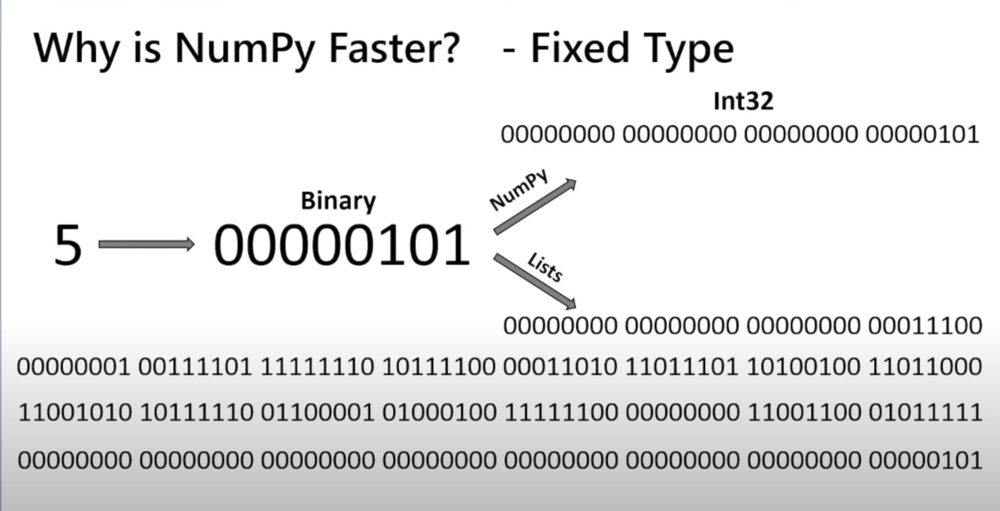
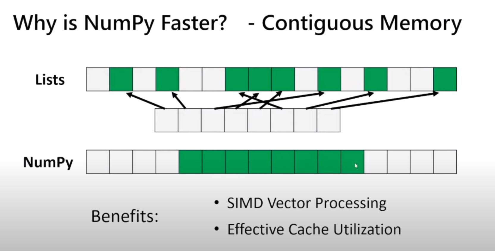

### Numpy Review:
(link:)[https://youtu.be/QUT1VHiLmmI]

Numpy can do operations on 1,2,3,..n dimensional arrays.

#### What is a difference between numpy and lists?
Numpy is faster and saves less data than a list. for example list has a builtin integer type that saves a lot of info about one digit, but numpy saves compressed data and makes it faster.

Also, numpy works with fixed data types whereas lists can save mixed datatypes. when we loop through a list, it checks the datatype for each iteration, but numpy doesn't do this checking and it makes it faster.
Lists use memory blocks in a scattered way buy numpy uses them all next to each other. 

The code along is in this colab:

https://colab.research.google.com/drive/13Max8oYEFW2rofDf-fimNkUPSSwqmdfE?usp=sharing

> Written with [StackEdit](https://stackedit.io/).